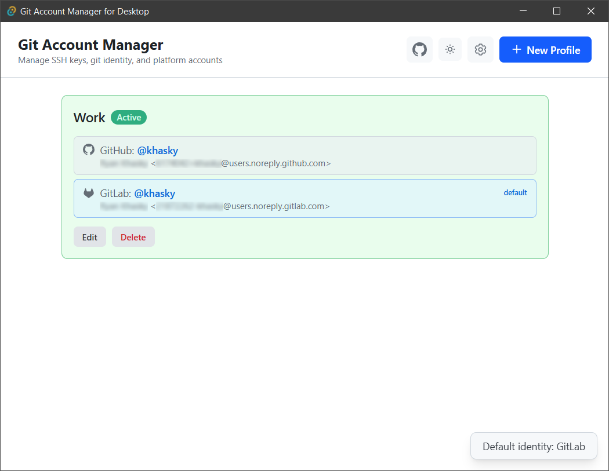
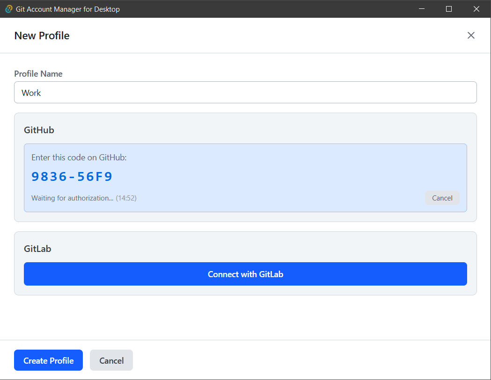
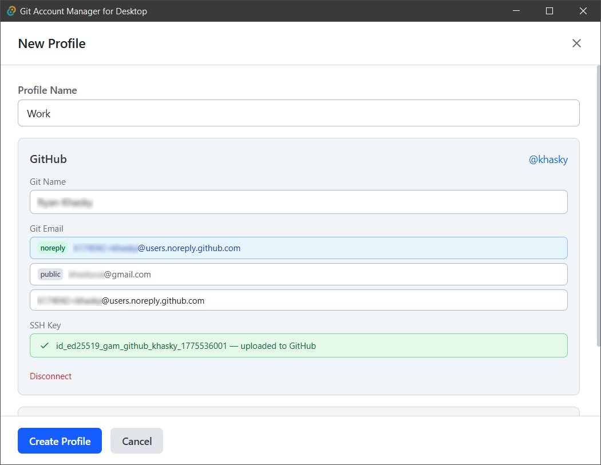

<div align="center">


# Git Account Manager

**Switch GitHub, GitLab &amp; Bitbucket identities — SSH keys, git config, and connected accounts in one click.**

[](https://github.com/khasky/git-account-manager/releases)
[](https://github.com/khasky/git-account-manager/releases)
[](../../actions)
[](LICENSE)

[](../../stargazers)

[Features](#features) • [Install](#installation) • [Quick start](#quick-start-guide) • [Develop](#development) • [Troubleshooting](#troubleshooting)



<sub>Built with <b>Tauri v2</b> (Rust) · <b>React</b> · <b>TypeScript</b> · <b>Tailwind CSS</b></sub>

</div>

## Features

- **Profiles** — Create, edit, and delete named accounts. Each profile can link **GitHub**, **GitLab**, and **Bitbucket** — any one or several at once.
- **One-click activation** — Activating a profile updates **global** `git config user.name` / `user.email` and rewrites `~/.ssh/config` so SSH to **github.com** / **gitlab.com** / **bitbucket.org** uses that profile's key.
- **Default identity** — When several platforms are connected, choose which account supplies the active **git identity** (name/email).
- **OAuth sign-in** — **GitHub** via device code flow, **GitLab.com** via browser authorization + PKCE, **Bitbucket** via an Atlassian API token. Client / Application IDs are configurable in Settings (with built-in defaults).
- **SSH keys** — Generate **Ed25519** keys with `ssh-keygen`, attach an existing key from `~/.ssh`, **upload** keys to the host, optionally **remove** them when deleting a profile, and **copy a public key** to the clipboard.
- **System tray** — Closing the window hides the app; restore or quit from the tray.
- **Polished UX** — **Light / dark / system** themes, **11 interface languages**, launch-at-login, and an optional **OpenSSH** mode for **TortoiseGit** and **Git CLI**.

## Why Git Account Manager?

It's the only tool here that **generates and uploads an SSH key for you from a GUI** — and the only free, open-source app built specifically for juggling Git identities. The well-known alternatives either live in the terminal (`gh`, GCM) or are paid clients (GitKraken).

| | **Git Account Manager** | [`gh` CLI](https://github.com/cli/cli) | [GitHub Desktop](https://github.com/desktop/desktop) | [GCM](https://github.com/git-ecosystem/git-credential-manager) | [GitKraken](https://www.gitkraken.com/) |
|---|:---:|:---:|:---:|:---:|:---:|
| Desktop GUI | ✅ | ❌ CLI | ✅ | ❌ | ✅ |
| Generate + upload SSH key | ✅ | ⚠️ login only | ❌ | ❌ | ⚠️ |
| GitHub / GitLab / Bitbucket | ✅ | GitHub | GitHub | ✅ +Azure | ✅ |
| One-click identity switch | ✅ | CLI | ❌ | auto | ✅ |
| HTTPS credential helper | 🚧 _planned_ | ✅ | ✅ | ✅ | ✅ |
| Free & open source (MIT) | ✅ | ✅ | ✅ | ✅ | ❌ _paid_ |

<sub>Measured against the most-used tools in the space — <b><code>gh</code></b> 44k★ · <b>GitHub Desktop</b> 21k★ · <b>GCM</b> 8.9k★ · <b>GitKraken</b> (popular paid client).</sub>

<details>
<summary><b>More screenshots</b></summary>

<br>





</details>

## Installation

Download the latest release for your OS from the [Releases](https://github.com/khasky/git-account-manager/releases/) page.

### Quick Start Guide

| OS | Steps |
| --- | --- |
| **Windows** | Download the `.msi`, run it, follow the installer. |
| **macOS** | Download the `.dmg`, open it, drag the app to **Applications**. |
| **Linux** | Download the `.AppImage`, `chmod +x GitAccountManager.AppImage`, then run `./GitAccountManager.AppImage`. |

> First Windows launch may show a SmartScreen warning (the installer is not yet code-signed) — see [Troubleshooting](#troubleshooting).

## Security Notes

- OAuth and API tokens are stored in the OS credential store: **Windows Credential Manager**, **macOS Keychain**, or a Linux **Secret Service** provider.
- The JSON state file stores profile metadata and SSH key paths, but not tokens.
- Windows credentials are persistent for the current Windows user.
- macOS may ask for Keychain access again after reinstalling the app or changing the app signature.
- On Linux, a desktop keyring service such as GNOME Keyring, KWallet, or another compatible Secret Service provider must be available for token-backed actions. Headless or minimal Linux environments may require additional keyring setup.
- A normal reinstall or upgrade should keep connected accounts working for the same OS user as long as both the app data file and OS credential store entries remain. Moving only `profiles.json` to another machine does not move tokens; reconnect accounts in that case.

## Development

<details>
<summary><b>Prerequisites</b> — Node 18+, pnpm, Rust, MSVC/clang/gcc, Git</summary>

<br>

#### Node.js (v18+)

Download from [nodejs.org](https://nodejs.org/) or install via winget:

```bash
winget install OpenJS.NodeJS.LTS
```

#### pnpm

```bash
npm install -g pnpm
```

#### Rust & Cargo

**Windows:**

```bash
winget install Rustlang.Rustup --source winget
```

Or download the installer from [rustup.rs](https://rustup.rs/).

You also need the **MSVC C++ Build Tools** — see the [Visual C++ Build Tools](#visual-c-build-tools-windows-only) step below.

After install, make sure `cargo` is in your PATH. You may need to restart your terminal. Verify:

```bash
rustc --version
cargo --version
```

If `cargo` is not found after install, add it to PATH manually:

```powershell
$env:Path = "$env:USERPROFILE\.cargo\bin;" + $env:Path
```

**macOS:**

```bash
curl --proto '=https' --tlsv1.2 -sSf https://sh.rustup.rs | sh
```

Rust links with **clang** from the **Xcode Command Line Tools**; without them the build fails with `error: linker 'cc' not found`. Install them with:

```bash
xcode-select --install
```

**Linux (Debian/Ubuntu):**

```bash
curl --proto '=https' --tlsv1.2 -sSf https://sh.rustup.rs | sh
sudo apt install build-essential libwebkit2gtk-4.1-dev libappindicator3-dev librsvg2-dev patchelf
```

`build-essential` provides **gcc** and the system linker (`cc` / `ld`) that Rust needs; without it the build fails with `error: linker 'cc' not found`. The remaining packages are Tauri's WebView and runtime dependencies. (See the [Tauri v2 prerequisites](https://v2.tauri.app/start/prerequisites/) for other distros.)

#### Visual C++ Build Tools (Windows only)

Rust's default Windows target (`x86_64-pc-windows-msvc`) links with the **MSVC linker** (`link.exe`), which is **not** bundled with Rustup, Node, or VS Code. Without it the desktop build fails with a `link.exe` not found error (see [Troubleshooting](#troubleshooting)).

Install the **"Desktop development with C++"** workload from the [Visual Studio Build Tools](https://visualstudio.microsoft.com/visual-cpp-build-tools/), or add it to an existing Visual Studio install via **Visual Studio Installer → Modify**. The Rustup installer normally offers to set this up for you — don't skip that prompt.

#### Git & ssh-keygen

Git must be installed and available in PATH (needed for `git config` and `ssh-keygen`).

```bash
git --version
ssh-keygen -V
```

</details>

### Install & Run

```bash
pnpm install
```

**Development**

| Target                                                         | Command            | Notes                                                              |
| -------------------------------------------------------------- | ------------------ | ------------------------------------------------------------------ |
| **Web** (browser only, faster UI work; Tauri APIs unavailable) | `pnpm dev:web`     | Vite on [http://localhost:1420](http://localhost:1420)             |
| **Desktop** (full Tauri shell)                                 | `pnpm dev:desktop` | Same as `pnpm tauri dev`; starts the Vite dev server automatically |

### Build

| Target      | Command              | Output                                                               |
| ----------- | -------------------- | -------------------------------------------------------------------- |
| **Web**     | `pnpm build:web`     | Static files in `dist/`                                              |
| **Desktop** | `pnpm build:desktop` | Same as `pnpm tauri build`; runs `build:web` first, then Rust bundle |

Installers are generated under `src-tauri/target/release/bundle/`.

<details>
<summary><b>Windows packaging: why not MSIX / Microsoft Store?</b></summary>

<br>

The Windows build produces an **MSI** (WiX) and an **NSIS** `.exe` installer — **not** an MSIX package. Distributing through the **Microsoft Store** would require MSIX, which is currently not viable: MSIX runs the app inside a container with **filesystem and registry virtualization**, and that breaks several core features even with the `runFullTrust` capability:

| Feature                                      | Why MSIX breaks it                                                                                                                                                                                            |
| -------------------------------------------- | ------------------------------------------------------------------------------------------------------------------------------------------------------------------------------------------------------------- |
| **TortoiseGit integration**                  | The app writes `HKCU\Software\TortoiseGit\SSH` so the _external_ TortoiseGit process reads it. Inside MSIX, `HKCU` writes are redirected to the package's private registry, so TortoiseGit never sees the value. |
| **Launch at login (autostart)**              | Autostart is registered via an `HKCU` `Run` key, which MSIX also virtualizes — it would not fire at login. MSIX requires a manifest `StartupTask` extension instead.                                            |
| **Running `git` / `ssh-keygen`**             | The app shells out to `git`, `ssh-keygen`, and `cmd` on the system `PATH`. Launching external executables from a packaged app behaves differently (container `PATH` / environment) and would need verification. |
| **Writing `~/.ssh/config` and git config**   | The app rewrites the user's real `~/.ssh/config` and global `.gitconfig`. Packaged-app file virtualization can redirect such writes away from the real user profile.                                            |

Until these are adapted (unvirtualized registry writes for TortoiseGit, a `StartupTask`-based autostart, and verified external-process / profile access), the app ships as a standard MSI + NSIS installer rather than MSIX.

</details>

### GitHub releases (CI)

Pushing a **version tag** triggers the [Build & Release](.github/workflows/build.yml) workflow: it builds installers for Windows, Linux, and macOS, then attaches them to a GitHub Release.

1. Bump the version consistently in `package.json`, `src-tauri/tauri.conf.json`, and `src-tauri/Cargo.toml`.
2. Commit and push those changes to `main` (or your default branch).
3. Create a tag whose name starts with **`v`** (the workflow only publishes on `refs/tags/v*`):

```bash
git tag v0.1.0   # same version as in tauri/package
git push origin v0.1.0
```

Pushes to `main` or pull requests still build the app, but a **GitHub Release is published only on a `v*` tag** — that run (via [`tauri-action`](https://github.com/tauri-apps/tauri-action)) also uploads the signed installers and the updater manifest (`latest.json`). Branch/PR runs keep their installers as downloadable CI artifacts instead.

### Auto-updates (tauri-plugin-updater)

The app checks **GitHub Releases** on startup and, when a newer signed build exists, shows a banner that downloads, installs, and relaunches in one click. The updater endpoint and signing **public** key live in `src-tauri/tauri.conf.json` under `plugins.updater`.

Updater artifacts (`latest.json` + per-installer `.sig`) are signed with a [minisign](https://jedisct1.github.io/minisign/) key pair generated by `pnpm tauri signer generate`.

### IDE Setup

- [VS Code](https://code.visualstudio.com/) + [Tauri](https://marketplace.visualstudio.com/items?itemName=tauri-apps.tauri-vscode) + [rust-analyzer](https://marketplace.visualstudio.com/items?itemName=rust-lang.rust-analyzer)

## Troubleshooting

<details>
<summary><b>Windows: "Windows protected your PC" (SmartScreen) when running the installer</b></summary>

<br>

When you launch the Windows installer (`Git.Account.Manager_<version>_x64_en-US.msi`), Microsoft Defender SmartScreen may show a blue full-screen dialog titled **"Windows protected your PC"**, with the message *"Microsoft Defender SmartScreen prevented an unrecognized app from starting"* and **Publisher: Unknown publisher**.

This is **not** a malware detection. SmartScreen is **reputation-based**: it warns about any installer that is **not signed with a paid code-signing certificate** or that has not yet accumulated enough download "reputation" with Microsoft. The Git Account Manager installer is currently **unsigned** — adding a code-signing certificate is a planned step, not an indication that the app is unsafe.

**Why you can trust it**

| Reason | Detail |
| ------ | ------ |
| **Open source** | The full source code is public on [GitHub](https://github.com/khasky/git-account-manager) and licensed under **MIT** — anyone can read, audit, or rebuild it. |
| **Reproducible builds** | Official installers are produced automatically by the [GitHub Actions release workflow](.github/workflows/build.yml) from that public source, not handcrafted on a developer's machine. |
| **Official source only** | Download installers **only** from the [GitHub Releases](https://github.com/khasky/git-account-manager/releases) page. Never trust a copy from a third-party mirror. |

**How to continue the installation**

1. In the SmartScreen dialog, click **More info** (skip this if the **Run anyway** button is already shown, as in the expanded view).
2. Confirm the app name is **Git Account Manager** and the file matches the one downloaded from GitHub Releases.
3. Click **Run anyway** to proceed with the installation.

The warning typically disappears for everyone once the installer is code-signed or has earned enough SmartScreen reputation over time.

</details>

<details>
<summary><b>Git for Windows: "Git Credential Manager" or "None" — does it matter?</b></summary>

<br>

During **Git for Windows** setup, the **"Choose a credential helper"** step offers **Git Credential Manager (GCM)** (default) or **None**. Either choice is fine — **Git Account Manager does not require a credential helper** and works out of the box with both.

This app drives Git over **SSH**, not HTTPS:

- It switches your active identity with `git config --global user.name` / `user.email`.
- It rewrites `~/.ssh/config` so SSH to **github.com** / **gitlab.com** uses the selected profile's key (`User git`, `IdentityFile`, `IdentitiesOnly yes`).
- OAuth sign-in and SSH-key upload talk to the GitHub/GitLab APIs directly, not through Git.

SSH authenticates with **keys**, which never use a credential helper — so the GCM-vs-None choice does not affect anything this app does.

**The credential helper only matters for HTTPS remotes** (`https://github.com/...`), which this app does not manage:

| Your Git remotes                                          | If you pick "None"                                                                                                                                                                                  |
| --------------------------------------------------------- | --------------------------------------------------------------------------------------------------------------------------------------------------------------------------------------------------- |
| **SSH** (`git@github.com:...`) — what this app configures | Works out of the box; nothing else needed.                                                                                                                                                          |
| **HTTPS** (`https://github.com/...`)                      | Git prompts for credentials on every push/pull (GitHub requires a **personal access token**, not a password). This is standard Git/HTTPS behavior, unrelated to this app — keeping **GCM** is smoother. |

</details>

<details>
<summary><b>GitHub: <code>device code error: {"error":"Not Found"}</code></b></summary>

<br>

This is returned when GitHub responds with an error to the **device authorization** request (`POST https://github.com/login/device/code`). The app shows the response body from GitHub; `Not Found` usually means GitHub does not accept the **Client ID** or the app is not set up for this flow.

**Typical causes and what to try**

| Situation                      | What to check / fix                                                                                                                                                                                                                                                                    |
| ------------------------------ | -------------------------------------------------------------------------------------------------------------------------------------------------------------------------------------------------------------------------------------------------------------------------------------- |
| **Wrong or unknown Client ID** | The ID in **Settings → GitHub OAuth** must match an existing [OAuth App](https://github.com/settings/developers) under your account (or org). Typos, extra spaces, or an app that was **deleted** produce this kind of error. Create a new OAuth App or restore the correct Client ID. |
| **OAuth App not created yet**  | Complete **New OAuth App** in GitHub Developer Settings before pasting the Client ID.                                                                                                                                                                                                  |
| **Device flow disabled**       | In the OAuth App settings on GitHub, enable **Device flow** (required for "Connect with GitHub"). Without it, authorization for this desktop flow may fail.                                                                                                                            |
| **Wrong app type**             | Use a **GitHub OAuth App**, not a **GitHub App**—their credentials and flows differ.                                                                                                                                                                                                   |

After changing settings on GitHub, save the app, copy the Client ID again into this application, and retry **Connect with GitHub**.

</details>

<details>
<summary><b>GitLab (browser): "Client authentication failed … unknown client"</b></summary>

<br>

This appears on **GitLab's website** (URL like `gitlab.com/oauth/authorize?...`) immediately after you click **Connect with GitLab**, when the browser opens the authorization page. GitLab rejects the OAuth application before you can approve access.

**Typical causes and what to try**

| Situation                           | What to check / fix                                                                                                                                                                                                                                                                                                                                                   |
| ----------------------------------- | --------------------------------------------------------------------------------------------------------------------------------------------------------------------------------------------------------------------------------------------------------------------------------------------------------------------------------------------------------------------- |
| **Wrong or unknown Application ID** | The value in **Settings → GitLab OAuth** must be the **Application ID** from your [GitLab application](https://gitlab.com/-/user_settings/applications) on **GitLab.com**. Typos, extra spaces, a **deleted** application, or an ID from another GitLab instance will trigger **unknown client**. Create a new application or copy the ID again from the correct app. |
| **Application not created yet**     | Finish **Add new application** on GitLab before pasting the Application ID (see in-app steps for redirect URI and scopes).                                                                                                                                                                                                                                            |
| **Confidential / auth method**      | This app uses a **public** client with PKCE (no client secret). On GitLab, leave **Confidential** **unchecked** when creating the application. A **confidential** app can lead to **unsupported authentication method** (or related failures) during token exchange because the flow does not send a client secret.                                                   |
| **Redirect URI or scopes**          | Set **Redirect URI** to `http://localhost:19847/callback` and enable the **api** scope, as shown in Settings. A mismatch can cause other OAuth errors; fix the application on GitLab to match.                                                                                                                                                                        |

After fixing the application on GitLab, click **Save Settings** in this app, then try **Connect with GitLab** again.

</details>

<details>
<summary><b>GitLab: <code>error sending request for url (https://gitlab.com/oauth/token)</code></b></summary>

<br>

After you click **Connect with GitLab**, the browser completes authorization and the app exchanges the authorization code for an access token by **POST**ing to `https://gitlab.com/oauth/token`. That message is returned when the HTTP client **cannot complete the request** (no response was received). It is a **transport** failure, not a wrong Client ID or redirect URI (those usually produce a different error after GitLab responds).

**Typical causes and what to try**

| Situation                    | What to check / fix                                                                                                                                                                                                                                                     |
| ---------------------------- | ----------------------------------------------------------------------------------------------------------------------------------------------------------------------------------------------------------------------------------------------------------------------- |
| **No route to the internet** | Confirm the machine can open [https://gitlab.com](https://gitlab.com) in a browser and that nothing is forcing offline mode.                                                                                                                                            |
| **DNS**                      | Ensure `gitlab.com` resolves (`nslookup gitlab.com` or ping). Corporate DNS or a broken hosts file can block the name.                                                                                                                                                  |
| **Firewall / proxy**         | Allow **outbound HTTPS** to `gitlab.com` (port 443). If you must use an HTTP(S) proxy, the app's Rust `reqwest` stack must see proxy settings (system env vars such as `HTTPS_PROXY` are often required for CLI/desktop tools on Windows).                              |
| **TLS / certificates**       | HTTPS inspection (corporate proxy, antivirus) can break TLS if a custom root is not trusted by the TLS stack the app uses (**rustls** + Mozilla root store in this project). Try without inspection, or install/trust the corporate root as required by your IT policy. |
| **VPN or split tunneling**   | Some VPNs block or misroute `gitlab.com`; disconnect or adjust split tunneling and retry.                                                                                                                                                                               |
| **GitLab availability**      | Rare, but check [GitLab status](https://status.gitlab.com/) if everything else works in the browser.                                                                                                                                                                    |

**Quick checks**

1. In a terminal on the same PC: `curl -I https://gitlab.com/oauth/token` (or open the URL in a browser; you may get a method-not-allowed response, that still proves reachability).
2. Temporarily disable VPN / third-party firewall / HTTPS-scanning antivirus to see if the error disappears (then re-enable and narrow the exception).

**Note:** OAuth in this app targets **GitLab.com** (`gitlab.com`). Self-managed GitLab instances use different hostnames and are not covered by the built-in URLs.

</details>

## Roadmap

- **HTTPS / PAT support** — work with HTTPS remotes via a built-in git **credential helper** (not just SSH).
- **Per-folder identity** — bind a directory to a profile via `includeIf "gitdir:…"`.
- **CLI** — `gam set <profile>` for terminals, CI, and dotfiles.

## Contributing

Contributions are welcome!

1. Fork the repository.
2. Create a new branch: `git checkout -b feature-branch-name`.
3. Make your changes and commit them: `git commit -m 'Add some feature'`.
4. Push to the branch: `git push origin feature-branch-name`.
5. Submit a pull request.

## License

This project is licensed under the MIT License. See the [LICENSE](https://github.com/khasky/git-account-manager/blob/main/LICENSE) file for details.
