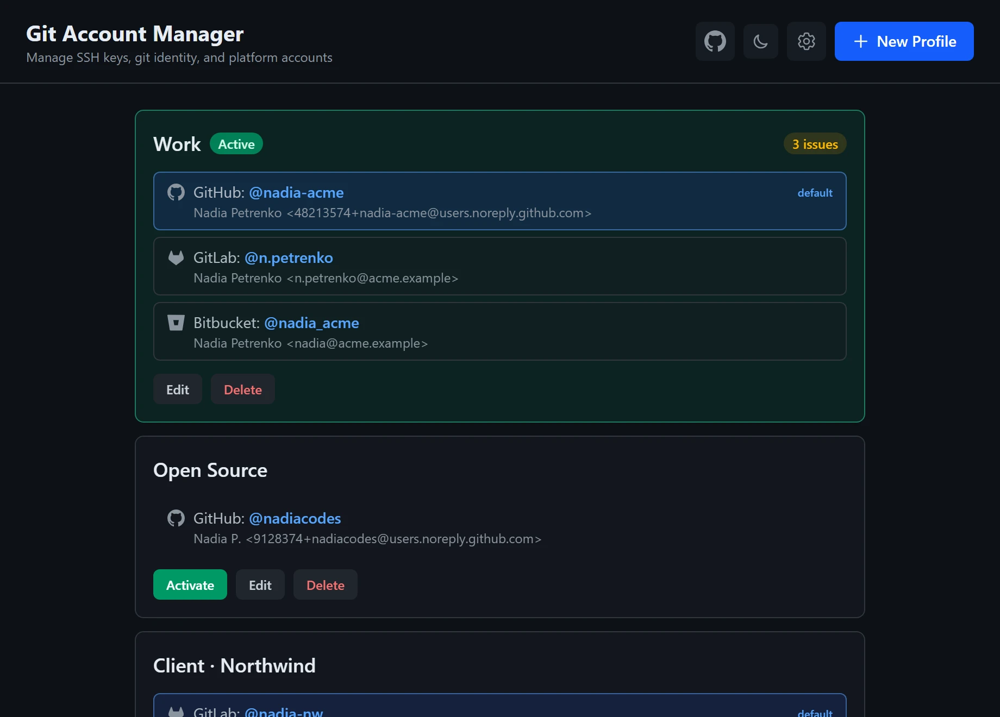
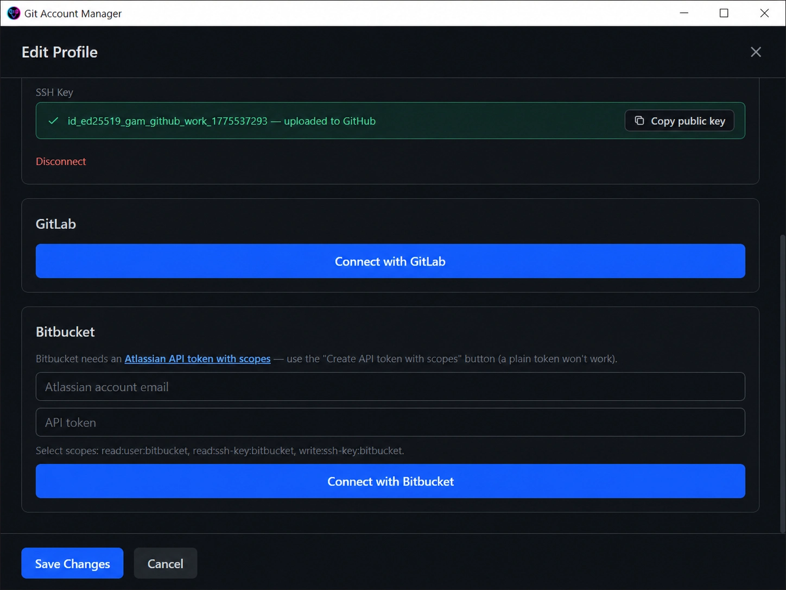
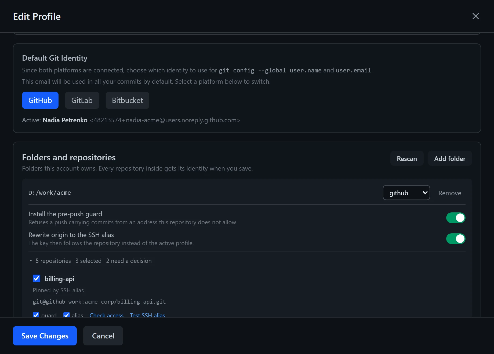
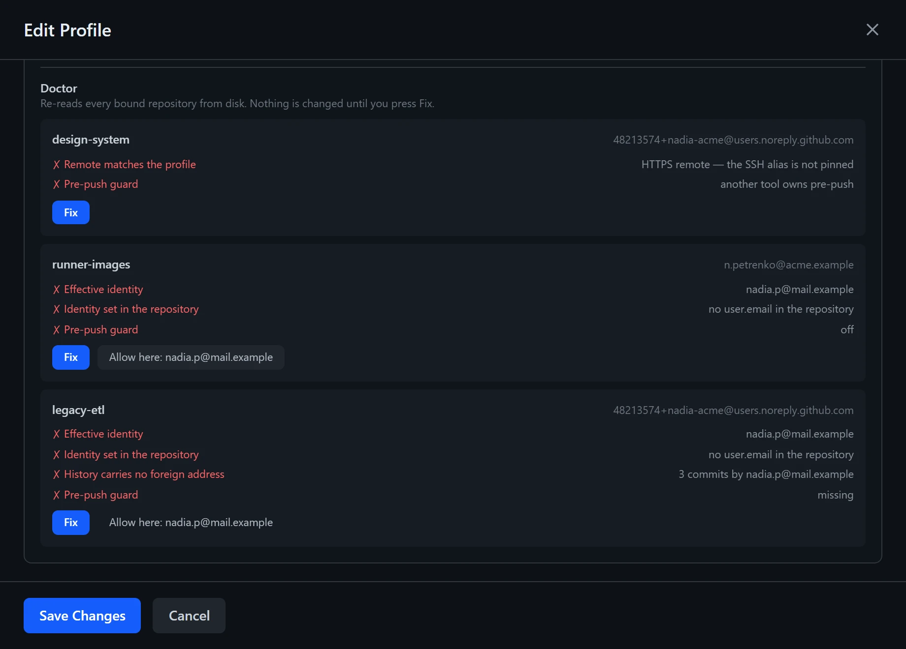
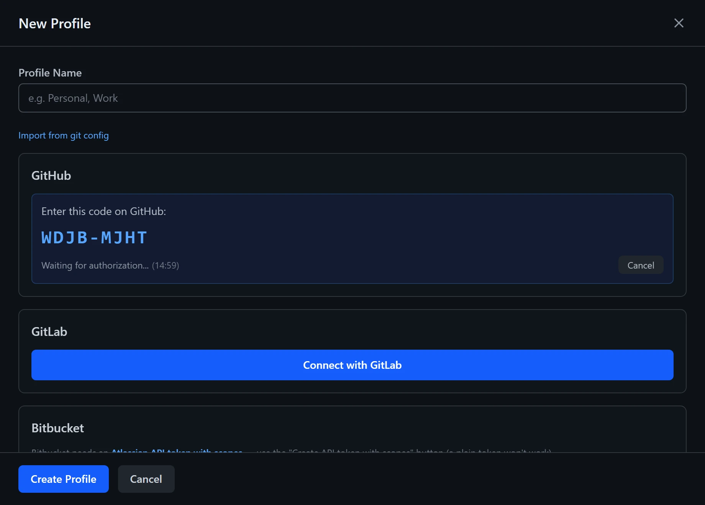
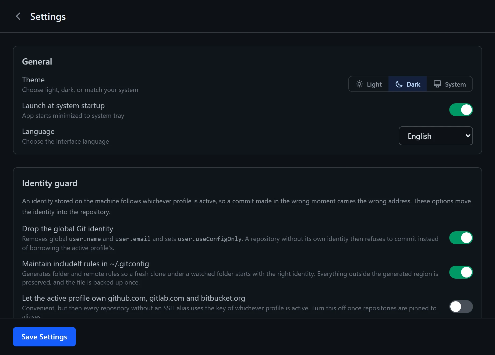

<div align="center">


# Git Account Manager

A desktop Git account manager for identity switching across popular code hosting platforms.

[](LICENSE) [](./package.json) [](https://github.com/khasky/git-account-manager/issues) [](https://github.com/khasky/git-account-manager/releases) [](https://github.com/khasky/git-account-manager/actions/workflows/build.yml)  [](https://github.com/sponsors/khasky) [](https://emojery.app/react?t=github/khasky/git-account-manager)

[Features](#features) · [Why GAM?](#why-git-account-manager) · [Folder-scoped identity](#folder-scoped-identity) · [Install](#installation) · [Security Notes](#security-notes) · [Development](#development) · [Troubleshooting](#troubleshooting) · [Roadmap](#roadmap) · [Contributing](#contributing) · [Reporting a vulnerability](#reporting-a-vulnerability) · [Support](#support) · [License](#license)

<picture>
  <source media="(prefers-color-scheme: dark)"  srcset="screenshots/dark1.webp">
  <source media="(prefers-color-scheme: light)" srcset="screenshots/light1.webp">
  
</picture>

<sub>Built with <b>Tauri v2</b> (Rust) · <b>React</b> · <b>TypeScript</b> · <b>Tailwind CSS</b></sub>

</div>

## Features

- **Profiles** — Create, edit, and delete named accounts. Each profile can link **GitHub**, **GitLab**, and **Bitbucket** — any one or several at once.
- **One-click activation** — Activating a profile updates **global** `git config user.name` / `user.email` and rewrites `~/.ssh/config` so SSH to **github.com** / **gitlab.com** / **bitbucket.org** uses that profile's key.
- **Folder-scoped identity** — Give a profile its folders and every repository inside one, at any depth, gets that account's name, address and SSH key from a generated `includeIf` rule. Nothing is written inside a repository. A machine-wide **commit guard** refuses a commit from any other address, and a **Doctor** watches the folders and says when one moved. See [Folder-scoped identity](#folder-scoped-identity).
- **Default identity** — When several platforms are connected, choose which account supplies the active **git identity** (name/email).
- **Import from Git** — Start a new profile from the current global Git identity so existing `user.name` / `user.email` settings are not lost.
- **OAuth sign-in** — **GitHub** via device code flow, **GitLab.com** via browser authorization + PKCE, **Bitbucket** via an Atlassian API token. Client / Application IDs are configurable in Settings (with built-in defaults).
- **Secure token storage** — OAuth and API tokens are kept in the OS credential store (**Windows Credential Manager**, **macOS Keychain**, or Linux **Secret Service**) instead of plaintext JSON.
- **SSH keys** — Generate **Ed25519** keys with `ssh-keygen`, attach an existing key from `~/.ssh`, **upload** keys to the host, optionally **remove** them when deleting a profile, and **copy a public key** to the clipboard.
- **Commit signing** — The same Ed25519 key can sign commits: the app registers it as a signing key and writes `gpg.format = ssh`, `user.signingkey`, and `commit.gpgsign` for the profile. On GitHub the **Verified** badge additionally requires the commit email to be confirmed on the account. Signing runs through `git commit`, so clients that commit via libgit2 (TortoiseGit among them) may not produce a signature.
- **GitHub CLI** — Activating a profile also runs `gh auth switch` to that profile's GitHub login, so `gh` acts as the same account the SSH key does. Optional, on by default, skipped where `gh` is missing or not signed in to that login.
- **System tray** — Closing the window hides the app; the tray shows the active identity, lets you switch profiles, restore the window, or quit.
- **Auto updates** — The app checks GitHub Releases for newer signed builds and can download, install, and relaunch into the latest version from inside the app.
- **Polished UX** — **Light / dark / system** themes, **11 interface languages**, launch-at-login, and an optional **OpenSSH** mode for **TortoiseGit** and **Git CLI**.

## Why Git Account Manager?

It's the only tool here that **generates and uploads an SSH key for you from a GUI** — and the only free, open-source app built specifically for juggling Git identities. The well-known alternatives either live in the terminal (`gh`, GCM) or are paid clients (GitKraken).

|                             | **Git Account Manager** | [`gh` CLI](https://github.com/cli/cli) | [GitHub Desktop](https://github.com/desktop/desktop) | [GCM](https://github.com/git-ecosystem/git-credential-manager) | [GitKraken](https://www.gitkraken.com/) |
| --------------------------- | :---------------------: | :------------------------------------: | :--------------------------------------------------: | :------------------------------------------------------------: | :-------------------------------------: |
| Desktop GUI                 |           ✅            |                 ❌ CLI                 |                          ✅                          |                               ❌                               |                   ✅                    |
| Generate + upload SSH key   |           ✅            |             ⚠️ login only              |                          ❌                          |                               ❌                               |                   ⚠️                    |
| GitHub / GitLab / Bitbucket |           ✅            |                 GitHub                 |                        GitHub                        |                           ✅ +Azure                            |                   ✅                    |
| One-click identity switch   |           ✅            |                  CLI                   |                          ❌                          |                              auto                              |                   ✅                    |
| HTTPS credential helper     |      🚧 _planned_       |                   ✅                   |                          ✅                          |                               ✅                               |                   ✅                    |
| Free & open source (MIT)    |           ✅            |                   ✅                   |                          ✅                          |                               ✅                               |                ❌ _paid_                |

<sub>Measured against the most-used tools in the space — <b><code>gh</code></b> 44k★ · <b>GitHub Desktop</b> 21k★ · <b>GCM</b> 8.9k★ · <b>GitKraken</b> (popular paid client).</sub>

<details>
<summary><b>More screenshots</b></summary>

<br>

<picture>
  <source media="(prefers-color-scheme: dark)"  srcset="screenshots/dark3.webp">
  <source media="(prefers-color-scheme: light)" srcset="screenshots/light3.webp">
  
</picture>

<sub><b>Profile editor</b> — each connected platform keeps its own name, address and SSH key.</sub>

<br><br>

<picture>
  <source media="(prefers-color-scheme: dark)"  srcset="screenshots/dark4.webp">
  <source media="(prefers-color-scheme: light)" srcset="screenshots/light4.webp">
  
</picture>

<sub><b>Default identity and folders</b> — which account supplies the machine's default identity, and which folders the profile claims.</sub>

<br><br>

<picture>
  <source media="(prefers-color-scheme: dark)"  srcset="screenshots/dark5.webp">
  <source media="(prefers-color-scheme: light)" srcset="screenshots/light5.webp">
  
</picture>

<sub><b>Doctor</b> — what stopped holding in each folder, and the way to settle it.</sub>

<br><br>

<picture>
  <source media="(prefers-color-scheme: dark)"  srcset="screenshots/dark6.webp">
  <source media="(prefers-color-scheme: light)" srcset="screenshots/light6.webp">
  
</picture>

<sub><b>Connecting an account</b> — GitHub's device code flow, GitLab's browser authorization, Bitbucket's API token.</sub>

<br><br>

<picture>
  <source media="(prefers-color-scheme: dark)"  srcset="screenshots/dark2.webp">
  <source media="(prefers-color-scheme: light)" srcset="screenshots/light2.webp">
  
</picture>

<sub><b>Settings</b> — theme, autostart, 11 languages, and the guard rails that move the identity off the machine.</sub>

</details>

## Folder-scoped identity

A machine has no owner; a folder does. An identity kept in the global Git config follows whichever profile is active, so a commit made at the wrong moment silently carries the wrong address — and the commit object keeps it forever.

The active profile is the machine's default and covers everything you have not claimed. A **folder** claimed by another profile overrides it for everything underneath, and nothing of this app's is ever written inside a repository.

### Folders are the rule

Open a profile and add its **folders** under *Folders and repositories*, choosing which of that profile's platforms each one belongs to. Saving writes one block per folder into a delimited region of `~/.gitconfig`:

```gitconfig
[includeIf "gitdir/i:D:/repos/work/"]
	path = "C:/Users/you/AppData/Roaming/git-account-manager/identities/work-github.gitconfig"
```

and the file it points at carries everything a repository under that folder needs:

```gitconfig
[user]
	name = "Your Name"
	email = "you@work.example"
[core]
	sshCommand = "ssh -i \"C:/Users/you/.ssh/id_ed25519_work\" -o IdentitiesOnly=yes"
[gam]
	allowedEmail = "you@work.example"
```

That reaches **every repository under the folder at any depth**, including one cloned there tomorrow, with no scan and no decision to make. `core.sshCommand` is what carries the key, so `origin` keeps the canonical address and still pushes as the right account whichever profile is active. Everything outside the generated region is preserved and `~/.gitconfig` is backed up once.

The folder view lists the whole hierarchy a rule covers, indented by depth, so what a folder actually claims is visible before you save it. A repository whose remote points at a different site than the folder's platform is marked: the rule still covers it, and if that is wrong it needs a folder of its own.

Nothing is written while you edit. *Cancel* leaves the machine untouched, which is also what lets a profile be given its folders before it exists on disk.

A folder belongs to one account: saving a folder another profile already claims is refused by name rather than silently taking it away.

### Commit guard

The guard is one hooks directory the app owns, outside every repository, and the global `core.hooksPath` pointing at it. Each dispatcher there runs the check where it has a say — `pre-commit` refuses a commit whose author or committer the repository does not allow, before the commit exists; `pre-push` catches commits made before the folder was claimed — and then runs the repository's own hook of the same name, so lefthook, a hand-written hook or anything in `.git/hooks` keeps working. Nothing lands in a tracked folder, so nothing of the app's ever rides along with a commit.

What the dispatcher cannot reach is a repository whose local config sets `core.hooksPath` itself (husky does, at `npm install`): local wins over global and the guard never runs there. The Doctor reports that repository as *bypassed* rather than writing into its tracked folders. A global `core.hooksPath` that already points somewhere else is left alone, and enabling the guard says so instead of replacing it.

### Doctor

Five checks per folder: the folder is still there, its rule is in `~/.gitconfig`, **git itself resolves that identity** inside a repository under it, no repository there overrides the rule with a copy of its own, and the commit guard is in force. The third is the one that proves anything — a rule written but never applied looks fine right up to the commit that carries the wrong address, and only git can say whether it applied. The fourth is the one to act on: a local `user.email` beats the rule, so it would go on naming an address the profile has since changed. **Fix** rewrites the rule and takes those local copies back; a setting the rule does not supply is left alone.

The folders are also checked on a timer while the window is open, so a folder moved or renamed in a file manager surfaces on its own. When one is gone, the app looks for it nearby and recognises it by the repositories it held rather than by its name, which a disk full of folders called `src` cannot settle. A single confident match is offered as **Relink**; two equally good ones are a question, not an answer, and it says so instead of guessing. The window comes forward for a problem that was not already raised, once.

### Guard rails (Settings)

| Option                               | What it does                                                                                                                                                       |
| ------------------------------------ | ------------------------------------------------------------------------------------------------------------------------------------------------------------------- |
| **Guard commits with a global hook** | On by default. Points the global `core.hooksPath` at the app's dispatchers (see [Commit guard](#commit-guard)), which read the allowed address out of the folder rule. |

The active profile always owns the bare `github.com` / `gitlab.com` / `bitbucket.org` hosts, so a repository no folder claims still pushes with a key. A repository under a folder gets its key from that folder's rule instead, whichever profile is active. The Settings page lists which profile answers on each host, and a host the active profile has no account on is marked as refusing `git@<host>:` remotes.

## Installation

Download the latest release for your OS from the [Releases](https://github.com/khasky/git-account-manager/releases/) page.

### Quick Start Guide

| OS          | Steps                                                                                                     |
| ----------- | --------------------------------------------------------------------------------------------------------- |
| **Windows** | Download the `.msi`, run it, follow the installer.                                                        |
| **macOS**   | Download the `.dmg`, open it, drag the app to **Applications**.                                           |
| **Linux**   | Download the `.AppImage`, `chmod +x Git-Account-Manager-*-linux-x64.AppImage`, then run it.               |

> First Windows launch may show a SmartScreen warning (the installer is not yet code-signed) — see [Troubleshooting](#troubleshooting).

## Security Notes

- OAuth and API tokens are stored in the OS credential store: **Windows Credential Manager**, **macOS Keychain**, or a Linux **Secret Service** provider.
- The JSON state file stores profile metadata and SSH key paths, but not tokens.
- Windows credentials are persistent for the current Windows user.
- macOS may ask for Keychain access again after reinstalling the app or changing the app signature.
- On Linux, a desktop keyring service such as GNOME Keyring, KWallet, or another compatible Secret Service provider must be available for token-backed actions. Headless or minimal Linux environments may require additional keyring setup.
- A normal reinstall or upgrade should keep connected accounts working for the same OS user as long as both the app data file and OS credential store entries remain. Moving only `profiles.json` to another machine does not move tokens; reconnect accounts in that case.

## Development

<details>
<summary><b>Prerequisites</b> — Node 18+, pnpm, Rust, MSVC/clang/gcc, Git</summary>

<br>

#### Node.js (v18+)

Download from [nodejs.org](https://nodejs.org/) or install via winget:

```bash
winget install OpenJS.NodeJS.LTS
```

#### pnpm

```bash
npm install -g pnpm
```

#### Rust & Cargo

**Windows:**

```bash
winget install Rustlang.Rustup --source winget
```

Or download the installer from [rustup.rs](https://rustup.rs/).

You also need the **MSVC C++ Build Tools** — see the [Visual C++ Build Tools](#visual-c-build-tools-windows-only) step below.

After install, make sure `cargo` is in your PATH. You may need to restart your terminal. Verify:

```bash
rustc --version
cargo --version
```

If `cargo` is not found after install, add it to PATH manually:

```powershell
$env:Path = "$env:USERPROFILE\.cargo\bin;" + $env:Path
```

**macOS:**

```bash
curl --proto '=https' --tlsv1.2 -sSf https://sh.rustup.rs | sh
```

Rust links with **clang** from the **Xcode Command Line Tools**; without them the build fails with `error: linker 'cc' not found`. Install them with:

```bash
xcode-select --install
```

**Linux (Debian/Ubuntu):**

```bash
curl --proto '=https' --tlsv1.2 -sSf https://sh.rustup.rs | sh
sudo apt install build-essential libwebkit2gtk-4.1-dev libappindicator3-dev librsvg2-dev patchelf
```

`build-essential` provides **gcc** and the system linker (`cc` / `ld`) that Rust needs; without it the build fails with `error: linker 'cc' not found`. The remaining packages are Tauri's WebView and runtime dependencies. (See the [Tauri v2 prerequisites](https://v2.tauri.app/start/prerequisites/) for other distros.)

#### Visual C++ Build Tools (Windows only)

Rust's default Windows target (`x86_64-pc-windows-msvc`) links with the **MSVC linker** (`link.exe`), which is **not** bundled with Rustup, Node, or VS Code. Without it the desktop build fails with a `link.exe` not found error (see [Troubleshooting](#troubleshooting)).

Install the **"Desktop development with C++"** workload from the [Visual Studio Build Tools](https://visualstudio.microsoft.com/visual-cpp-build-tools/), or add it to an existing Visual Studio install via **Visual Studio Installer → Modify**. The Rustup installer normally offers to set this up for you — don't skip that prompt.

#### Git & ssh-keygen

Git must be installed and available in PATH (needed for `git config` and `ssh-keygen`).

```bash
git --version
ssh-keygen -V
```

</details>

### Install & Run

```bash
pnpm install
```

**Development**

| Target                                                         | Command            | Notes                                                              |
| -------------------------------------------------------------- | ------------------ | ------------------------------------------------------------------ |
| **Web** (browser only, faster UI work; Tauri APIs unavailable) | `pnpm dev:web`     | Vite on [http://localhost:1420](http://localhost:1420)             |
| **Desktop** (full Tauri shell)                                 | `pnpm dev:desktop` | Same as `pnpm tauri dev`; starts the Vite dev server automatically |
| **Screenshots** (regenerate `screenshots/`)                    | `pnpm screenshots` | Drives the real UI against an invented fixture — see [`scripts/screenshots/`](scripts/screenshots/). Needs `pnpm exec playwright install chromium` once |

### Build

| Target      | Command              | Output                                                               |
| ----------- | -------------------- | -------------------------------------------------------------------- |
| **Web**     | `pnpm build:web`     | Static files in `dist/`                                              |
| **Desktop** | `pnpm build:desktop` | Same as `pnpm tauri build`; runs `build:web` first, then Rust bundle |

Installers are generated under `src-tauri/target/release/bundle/`.

<details>
<summary><b>Windows packaging: why not MSIX / Microsoft Store?</b></summary>

<br>

The Windows build produces an **MSI** (WiX) and an **NSIS** `.exe` installer — **not** an MSIX package. Distributing through the **Microsoft Store** would require MSIX, which is currently not viable: MSIX runs the app inside a container with **filesystem and registry virtualization**, and that breaks several core features even with the `runFullTrust` capability:

| Feature                                    | Why MSIX breaks it                                                                                                                                                                                               |
| ------------------------------------------ | ---------------------------------------------------------------------------------------------------------------------------------------------------------------------------------------------------------------- |
| **TortoiseGit integration**                | The app writes `HKCU\Software\TortoiseGit\SSH` so the _external_ TortoiseGit process reads it. Inside MSIX, `HKCU` writes are redirected to the package's private registry, so TortoiseGit never sees the value. |
| **Launch at login (autostart)**            | Autostart is registered via an `HKCU` `Run` key, which MSIX also virtualizes — it would not fire at login. MSIX requires a manifest `StartupTask` extension instead.                                             |
| **Running `git` / `ssh-keygen`**           | The app shells out to `git`, `ssh-keygen`, and `cmd` on the system `PATH`. Launching external executables from a packaged app behaves differently (container `PATH` / environment) and would need verification.  |
| **Writing `~/.ssh/config` and git config** | The app rewrites the user's real `~/.ssh/config` and global `.gitconfig`. Packaged-app file virtualization can redirect such writes away from the real user profile.                                             |

Until these are adapted (unvirtualized registry writes for TortoiseGit, a `StartupTask`-based autostart, and verified external-process / profile access), the app ships as a standard MSI + NSIS installer rather than MSIX.

</details>

### GitHub releases (CI)

Pushing a `v*` tag triggers the [Build & Release](.github/workflows/build.yml) workflow: it bundles installers for Windows, Linux, and macOS (ARM and Intel) via [`tauri-action`](https://github.com/tauri-apps/tauri-action) and publishes them to a GitHub Release together with the updater manifest, `latest.json`.

A push to `main` runs the typecheck-and-test job only; a manual `workflow_dispatch` run bundles all four platforms and keeps the installers as CI artifacts without publishing.

Cutting a release is `pnpm release` followed by `git push --follow-tags` — the version bump across all four version files, the changelog, the commit, and the tag all come from that one command. The full runbook is [docs/releasing.md](docs/releasing.md).

### Auto-updates (tauri-plugin-updater)

The app checks **GitHub Releases** on startup and, when a newer signed build exists, shows a banner that downloads, installs, and relaunches in one click. The updater endpoint and signing **public** key live in `src-tauri/tauri.conf.json` under `plugins.updater`.

Every build is signed with a [minisign](https://jedisct1.github.io/minisign/) key pair generated by `pnpm tauri signer generate`. The signatures are embedded in `latest.json`, which is the only thing the updater fetches to decide whether an update is genuine.

### IDE Setup

- [VS Code](https://code.visualstudio.com/) + [Tauri](https://marketplace.visualstudio.com/items?itemName=tauri-apps.tauri-vscode) + [rust-analyzer](https://marketplace.visualstudio.com/items?itemName=rust-lang.rust-analyzer)

## Troubleshooting

<details>
<summary><b>Windows: "Windows protected your PC" (SmartScreen) when running the installer</b></summary>

<br>

When you launch the Windows installer (`Git-Account-Manager-<version>-win-x64.msi`), Microsoft Defender SmartScreen may show a blue full-screen dialog titled **"Windows protected your PC"**, with the message _"Microsoft Defender SmartScreen prevented an unrecognized app from starting"_ and **Publisher: Unknown publisher**.

This is **not** a malware detection. SmartScreen is **reputation-based**: it warns about any installer that is **not signed with a paid code-signing certificate** or that has not yet accumulated enough download "reputation" with Microsoft. The Git Account Manager installer is currently **unsigned** — adding a code-signing certificate is a planned step, not an indication that the app is unsafe.

**Why you can trust it**

| Reason                   | Detail                                                                                                                                                                                  |
| ------------------------ | --------------------------------------------------------------------------------------------------------------------------------------------------------------------------------------- |
| **Open source**          | The full source code is public on [GitHub](https://github.com/khasky/git-account-manager) and licensed under **MIT** — anyone can read, audit, or rebuild it.                           |
| **Reproducible builds**  | Official installers are produced automatically by the [GitHub Actions release workflow](.github/workflows/build.yml) from that public source, not handcrafted on a developer's machine. |
| **Official source only** | Download installers **only** from the [GitHub Releases](https://github.com/khasky/git-account-manager/releases) page. Never trust a copy from a third-party mirror.                     |

**How to continue the installation**

1. In the SmartScreen dialog, click **More info** (skip this if the **Run anyway** button is already shown, as in the expanded view).
2. Confirm the app name is **Git Account Manager** and the file matches the one downloaded from GitHub Releases.
3. Click **Run anyway** to proceed with the installation.

The warning typically disappears for everyone once the installer is code-signed or has earned enough SmartScreen reputation over time.

</details>

<details>
<summary><b>Git for Windows: "Git Credential Manager" or "None" — does it matter?</b></summary>

<br>

During **Git for Windows** setup, the **"Choose a credential helper"** step offers **Git Credential Manager (GCM)** (default) or **None**. Either choice is fine — **Git Account Manager does not require a credential helper** and works out of the box with both.

This app drives Git over **SSH**, not HTTPS:

- It switches your active identity with `git config --global user.name` / `user.email`.
- It rewrites `~/.ssh/config` so SSH to **github.com** / **gitlab.com** uses the selected profile's key (`User git`, `IdentityFile`, `IdentitiesOnly yes`).
- OAuth sign-in and SSH-key upload talk to the GitHub/GitLab APIs directly, not through Git.

SSH authenticates with **keys**, which never use a credential helper — so the GCM-vs-None choice does not affect anything this app does.

**The credential helper only matters for HTTPS remotes** (`https://github.com/...`), which this app does not manage:

| Your Git remotes                                          | If you pick "None"                                                                                                                                                                                      |
| --------------------------------------------------------- | ------------------------------------------------------------------------------------------------------------------------------------------------------------------------------------------------------- |
| **SSH** (`git@github.com:...`) — what this app configures | Works out of the box; nothing else needed.                                                                                                                                                              |
| **HTTPS** (`https://github.com/...`)                      | Git prompts for credentials on every push/pull (GitHub requires a **personal access token**, not a password). This is standard Git/HTTPS behavior, unrelated to this app — keeping **GCM** is smoother. |

</details>

<details>
<summary><b>GitHub: <code>device code error: {"error":"Not Found"}</code></b></summary>

<br>

This is returned when GitHub responds with an error to the **device authorization** request (`POST https://github.com/login/device/code`). The app shows the response body from GitHub; `Not Found` usually means GitHub does not accept the **Client ID** or the app is not set up for this flow.

**Typical causes and what to try**

| Situation                      | What to check / fix                                                                                                                                                                                                                                                                    |
| ------------------------------ | -------------------------------------------------------------------------------------------------------------------------------------------------------------------------------------------------------------------------------------------------------------------------------------- |
| **Wrong or unknown Client ID** | The ID in **Settings → GitHub OAuth** must match an existing [OAuth App](https://github.com/settings/developers) under your account (or org). Typos, extra spaces, or an app that was **deleted** produce this kind of error. Create a new OAuth App or restore the correct Client ID. |
| **OAuth App not created yet**  | Complete **New OAuth App** in GitHub Developer Settings before pasting the Client ID.                                                                                                                                                                                                  |
| **Device flow disabled**       | In the OAuth App settings on GitHub, enable **Device flow** (required for "Connect with GitHub"). Without it, authorization for this desktop flow may fail.                                                                                                                            |
| **Wrong app type**             | Use a **GitHub OAuth App**, not a **GitHub App**—their credentials and flows differ.                                                                                                                                                                                                   |

After changing settings on GitHub, save the app, copy the Client ID again into this application, and retry **Connect with GitHub**.

</details>

<details>
<summary><b>GitLab (browser): "Client authentication failed … unknown client"</b></summary>

<br>

This appears on **GitLab's website** (URL like `gitlab.com/oauth/authorize?...`) immediately after you click **Connect with GitLab**, when the browser opens the authorization page. GitLab rejects the OAuth application before you can approve access.

**Typical causes and what to try**

| Situation                           | What to check / fix                                                                                                                                                                                                                                                                                                                                                   |
| ----------------------------------- | --------------------------------------------------------------------------------------------------------------------------------------------------------------------------------------------------------------------------------------------------------------------------------------------------------------------------------------------------------------------- |
| **Wrong or unknown Application ID** | The value in **Settings → GitLab OAuth** must be the **Application ID** from your [GitLab application](https://gitlab.com/-/user_settings/applications) on **GitLab.com**. Typos, extra spaces, a **deleted** application, or an ID from another GitLab instance will trigger **unknown client**. Create a new application or copy the ID again from the correct app. |
| **Application not created yet**     | Finish **Add new application** on GitLab before pasting the Application ID (see in-app steps for redirect URI and scopes).                                                                                                                                                                                                                                            |
| **Confidential / auth method**      | This app uses a **public** client with PKCE (no client secret). On GitLab, leave **Confidential** **unchecked** when creating the application. A **confidential** app can lead to **unsupported authentication method** (or related failures) during token exchange because the flow does not send a client secret.                                                   |
| **Redirect URI or scopes**          | Set **Redirect URI** to `http://localhost:19847/callback` and enable the **api** scope, as shown in Settings. A mismatch can cause other OAuth errors; fix the application on GitLab to match.                                                                                                                                                                        |

After fixing the application on GitLab, click **Save Settings** in this app, then try **Connect with GitLab** again.

</details>

<details>
<summary><b>GitLab: <code>error sending request for url (https://gitlab.com/oauth/token)</code></b></summary>

<br>

After you click **Connect with GitLab**, the browser completes authorization and the app exchanges the authorization code for an access token by **POST**ing to `https://gitlab.com/oauth/token`. That message is returned when the HTTP client **cannot complete the request** (no response was received). It is a **transport** failure, not a wrong Client ID or redirect URI (those usually produce a different error after GitLab responds).

**Typical causes and what to try**

| Situation                    | What to check / fix                                                                                                                                                                                                                                                     |
| ---------------------------- | ----------------------------------------------------------------------------------------------------------------------------------------------------------------------------------------------------------------------------------------------------------------------- |
| **No route to the internet** | Confirm the machine can open [https://gitlab.com](https://gitlab.com) in a browser and that nothing is forcing offline mode.                                                                                                                                            |
| **DNS**                      | Ensure `gitlab.com` resolves (`nslookup gitlab.com` or ping). Corporate DNS or a broken hosts file can block the name.                                                                                                                                                  |
| **Firewall / proxy**         | Allow **outbound HTTPS** to `gitlab.com` (port 443). If you must use an HTTP(S) proxy, the app's Rust `reqwest` stack must see proxy settings (system env vars such as `HTTPS_PROXY` are often required for CLI/desktop tools on Windows).                              |
| **TLS / certificates**       | HTTPS inspection (corporate proxy, antivirus) can break TLS if a custom root is not trusted by the TLS stack the app uses (**rustls** + Mozilla root store in this project). Try without inspection, or install/trust the corporate root as required by your IT policy. |
| **VPN or split tunneling**   | Some VPNs block or misroute `gitlab.com`; disconnect or adjust split tunneling and retry.                                                                                                                                                                               |
| **GitLab availability**      | Rare, but check [GitLab status](https://status.gitlab.com/) if everything else works in the browser.                                                                                                                                                                    |

**Quick checks**

1. In a terminal on the same PC: `curl -I https://gitlab.com/oauth/token` (or open the URL in a browser; you may get a method-not-allowed response, that still proves reachability).
2. Temporarily disable VPN / third-party firewall / HTTPS-scanning antivirus to see if the error disappears (then re-enable and narrow the exception).

**Note:** OAuth in this app targets **GitLab.com** (`gitlab.com`). Self-managed GitLab instances use different hostnames and are not covered by the built-in URLs.

</details>

## Roadmap

- **HTTPS / PAT support** — work with HTTPS remotes via a built-in git **credential helper** (not just SSH).
- **CLI** — `gam set <profile>` for terminals, CI, and dotfiles.

## Contributing

Contributions are welcome! Fork the repo, create a branch, and open a pull request — see [CONTRIBUTING.md](./CONTRIBUTING.md) for the workflow.

Commits follow [Conventional Commits](https://www.conventionalcommits.org/) (e.g. `feat: …`, `fix: …`); a `commit-msg` hook enforces the format.

## Reporting a vulnerability

**Please do not open a public issue for security problems.**

Report privately through GitHub's [Security Advisories](https://github.com/khasky/git-account-manager/security/advisories/new)
("Report a vulnerability"). Include:

- what the issue is and where,
- steps to reproduce,
- the impact you expect.

You'll get an acknowledgement, and we'll coordinate a fix and disclosure timeline with you.

## Support

If **Git Account Manager** is useful to you, you can support development:

- [GitHub Sponsors](https://github.com/sponsors/khasky)
- [Patreon](https://www.patreon.com/khasky)
- [Buy Me a Coffee](https://www.buymeacoffee.com/khasky)

## License

This project is licensed under the MIT License. See the [LICENSE](./LICENSE) file for details.
